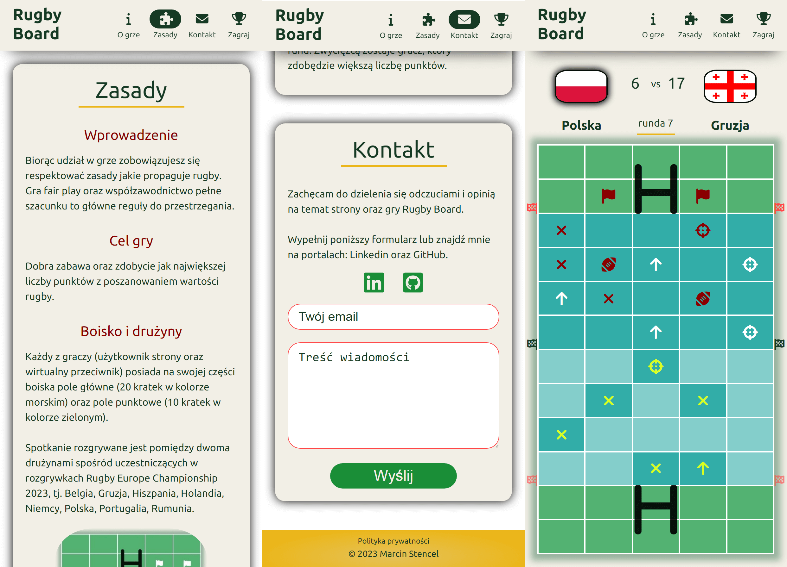

# Rugby Board

The project is a combination of the classic game of ships with the team sport - rugby. In addition, the website contains an extensive history of the game with a description of the game, as well as a contact form.

## What i used
          

## Screenshots

## Live
[https://rugby-board.netlify.app](https://rugby-board.netlify.app)

## Solutions
- BEM methodology
- Sass partial files
- The website enables the use of a keyboard (also a game)
- Two-level random arrangement of game icons
- Client-side form validation
- Form backend platform
- Responsive web design
- Clean comments